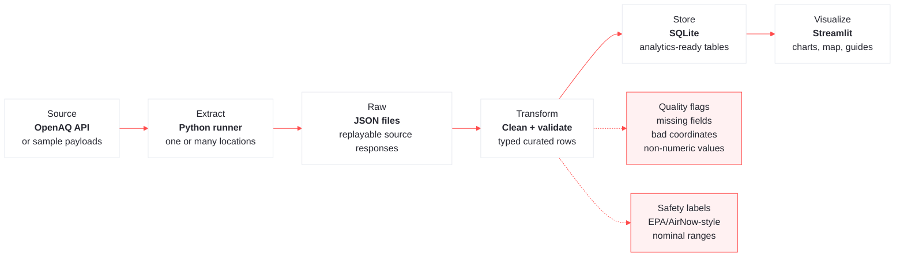
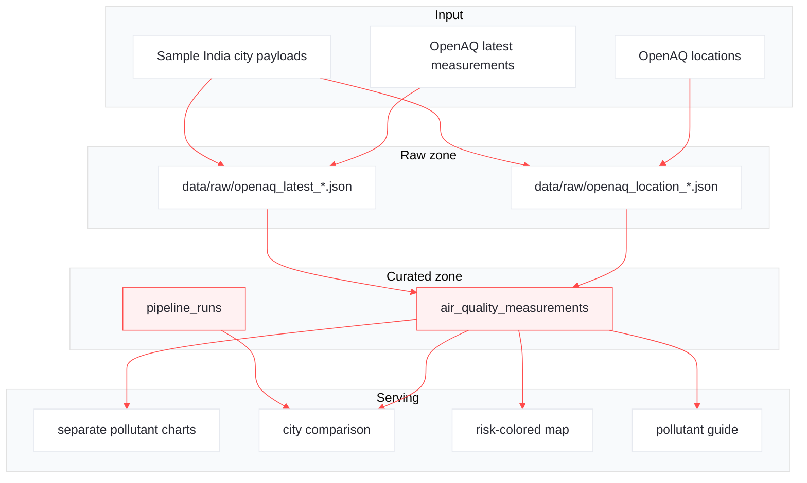

# Air Quality Pulse Visual Guide

  
Learning Project

  <h2 style="margin:6px 0 8px 0;">Air Quality Pulse</h2>
  

    A local data engineering pipeline that ingests public air-quality readings, preserves raw responses,
    creates curated analytics tables, validates rows, and visualizes city-level pollutant risk.
  

 

  

    
FLOW

    
5 stages

    
source to dashboard

  

  

    
DATA

    
raw + curated

    
JSON and SQLite

  

  

    
TOOLS

    
Python stack

    
SQLite, pandas, Altair, Streamlit

  

  

    
OUTCOME

    
DE basics

    
ingest, validate, serve, explain

  

## 1. Pipeline Flow

**How to read it:** the pipeline keeps source data and analytics data separate. Raw JSON is retained first, then curated rows are created for SQL and dashboard use.

## 2. Data Shape

  

    <h3 style="margin-top:0;">Main curated table</h3>
    
The dashboard reads from <code>air_quality_measurements</code>. Each row is one latest pollutant reading at one monitoring location.

    <table>
      <tr><th>Field group</th><th>Examples</th></tr>
      <tr><td>Location</td><td><code>location_id</code>, <code>location_name</code>, <code>country_code</code>, coordinates</td></tr>
      <tr><td>Pollutant</td><td><code>parameter</code>, <code>unit</code>, <code>value</code></td></tr>
      <tr><td>Time</td><td><code>measured_at_utc</code>, <code>measured_at_local</code></td></tr>
      <tr><td>Quality</td><td><code>quality_issues</code></td></tr>
      <tr><td>Lineage</td><td><code>source_url</code>, <code>ingested_at_utc</code></td></tr>
    </table>
  

  

    <h3 style="margin-top:0;">Run log table</h3>
    
<code>pipeline_runs</code> records each load so you can tell when it ran, what source URL was used, and how many rows were loaded.

    
This is the beginning of observability.

  

## 3. Layered Data Flow

## 4. Tools And Responsibilities

| Layer | Tool | Responsibility |
| --- | --- | --- |
| Source | OpenAQ API | Public location metadata and air-quality measurements. |
| Extract | Python | Calls API endpoints or loads sample payloads. |
| Raw storage | JSON files | Preserves original responses before transformation. |
| Transform | Python modules | Enriches readings with sensor metadata, validates values, adds safety context. |
| Store | SQLite | Local analytics database for measurements and run logs. |
| Visualize | Streamlit, pandas, Altair | Interactive filters, separate pollutant plots, maps, guides, and reference tables. |
| Verify | unittest | Protects transformation, threshold, pollutant, and multi-location behavior. |

## 5. Best Practices Checklist

| Best Practice | Why It Matters |
| --- | --- |
| Keep raw responses | Lets you debug and replay without calling the API again. |
| Create curated tables | Makes analytics easier than querying nested API JSON. |
| Use idempotent keys | Prevents duplicate rows when the same reading is loaded again. |
| Log each run | Gives visibility into row counts, source URLs, and load status. |
| Validate rows | Catches missing timestamps, invalid coordinates, and non-numeric readings. |
| Separate pollutant scales | PM2.5 and ozone use different units, so each needs its own plot. |
| Document thresholds | Safety labels need a clear source and caveat. |

## 6. Learning Outcomes

```mermaid
%%{init: {"theme": "base", "themeVariables": {"primaryColor": "#ffffff", "primaryBorderColor": "#e6e9ef", "primaryTextColor": "#262730", "lineColor": "#ff4b4b", "tertiaryColor": "#f8fafc", "fontFamily": "Inter, Arial"}}}%%
flowchart LR
    A["API ingestion"] --> B["Raw-to-curated modeling"]
    B --> C["Data quality checks"]
    C --> D["Local database serving"]
    D --> E["Unit-aware visualization"]
    E --> F["Data storytelling"]

    classDef outcome fill:#ffffff,stroke:#e6e9ef,color:#262730;
    classDef final fill:#fff1f2,stroke:#ff4b4b,color:#262730;
    class A,B,C,D,E outcome;
    class F final;
```

By the end of this project, you can explain not just the chart, but the engineering system behind it: where the data came from, how it was shaped, how it was checked, and why the visualization choices are trustworthy.

## 7. Project File Map

| File or Folder | Purpose |
| --- | --- |
| `scripts/run_air_quality_pipeline.py` | Runs sample or live ingestion for one or many locations. |
| `scripts/discover_india_locations.py` | Finds nearby live OpenAQ monitors for top Indian cities. |
| `src/air_quality_pulse/openaq_client.py` | Handles OpenAQ API requests. |
| `src/air_quality_pulse/pipeline.py` | Coordinates extraction, raw writes, transformation, and database load. |
| `src/air_quality_pulse/transform.py` | Builds curated measurement rows and quality issues. |
| `src/air_quality_pulse/storage.py` | Creates and writes SQLite tables. |
| `src/air_quality_pulse/thresholds.py` | Adds nominal EPA/AirNow safety labels. |
| `src/air_quality_pulse/pollutants.py` | Adds short pollutant effect descriptions. |
| `app/air_quality_dashboard.py` | Displays readings, comparisons, map, legend, and guides. |
| `tests/` | Verifies transformation, threshold, pollutant, and pipeline behavior. |

## References

- [OpenAQ API documentation](https://docs.openaq.org/)
- [OpenAQ API overview](https://docs.openaq.org/about/about)
- [OpenAQ quick start](https://docs.openaq.org/using-the-api/quick-start)
- [OpenAQ locations endpoint](https://docs.openaq.org/api/operations/locations_get_v3_locations_get)
- [AirNow AQI basics](https://www.airnow.gov/aqi/aqi-basics)
- [AirNow AQI colors](https://docs.airnowapi.org/aq101)
- [EPA particulate matter health effects](https://www.epa.gov/pm-pollution/health-and-environmental-effects-particulate-matter-pm)
- [EPA ozone health effects](https://www.epa.gov/ground-level-ozone-pollution/health-effects-ozone-pollution)
- [EPA nitrogen dioxide basics](https://www.epa.gov/no2-pollution/basic-information-about-no2)
