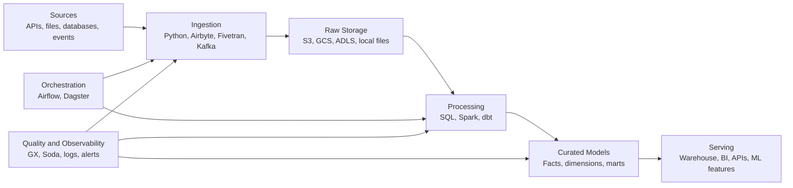
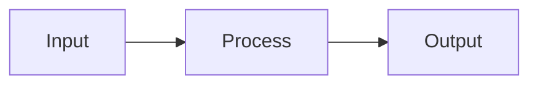
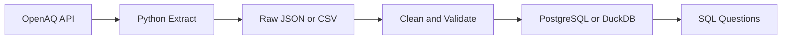
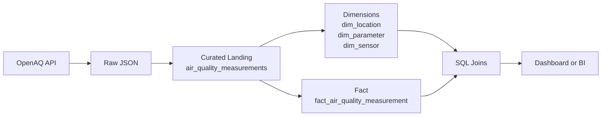
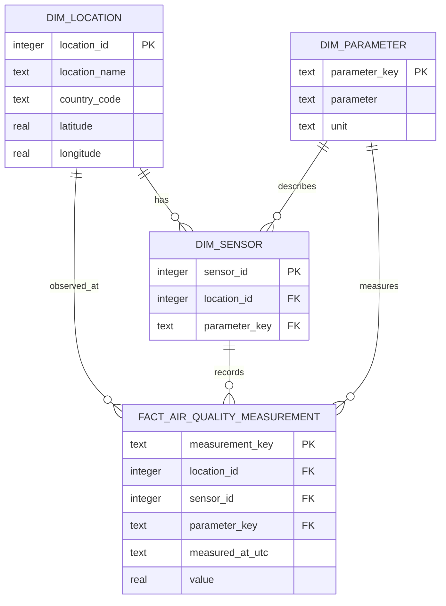
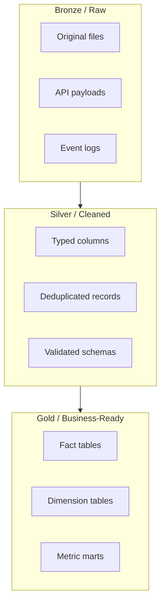

# Learning Notes and Industry Tools

Use this document as the ongoing notebook for new data engineering learning. Add notes as you implement each stage of the pipeline.

Related roadmap: [Data Engineering Learning Pipeline](./data-engineering-learning-pipeline.md)

## How to Use This Document

For each topic you learn, add:

- What problem the tool or concept solves
- Where it fits in a data pipeline
- A small implementation note
- For database topics, a few sample rows from each important table
- One mistake or lesson learned
- Links to official docs or high-quality references
- A visual, diagram, query, command, or screenshot when helpful

## Pipeline Mental Model



## Notes Template

Copy this block whenever you start a new learning topic.

~~~markdown
## Topic: <name>

Date:

### Goal

What I want to understand or build:

### Concept

Short explanation in my own words:

### Where It Fits

Pipeline stage:

### Implementation Notes

- 

### Commands, Queries, or Code

```text

```

### Sample Rows

For database tasks, include 2-4 rows from each important table so the table grain is easy to see.

### Visual



### Mistakes and Lessons

- 

### References

- 
~~~

## Topic: Local Foundations - Air Quality Pulse

Date: 2026-07-29

### Goal

Build a small local data pipeline that pulls public air-quality measurements from OpenAQ, cleans and validates the data, and loads an analytics-ready table into a local database.

Project idea: create an "Air Quality Pulse" dataset that answers:

- Which locations have the highest PM2.5 or ozone readings?
- How do readings change by hour or day?
- Which sensors have missing or suspicious measurements?
- Which cities or monitoring locations should be watched more closely?

### Concept

This topic turns the basic data engineering building blocks into one working loop:

1. Extract records from a public API.
2. Save the original response as raw data.
3. Clean and type the fields.
4. Validate required columns and obvious business rules.
5. Load curated data into a local database for SQL analysis.

### Where It Fits

Pipeline stage: source ingestion, raw storage, cleaning, validation, and local serving.



### Implementation Notes

- Public source: OpenAQ air-quality measurements.
- API platform: OpenAQ API v3.
- Start with one city or a small bounding box, then widen the scope.
- Keep the raw response unchanged so the pipeline can be debugged later.
- Create a curated table with typed timestamps, location, coordinates, pollutant parameter, value, unit, source, and ingestion timestamp.
- Add a simple load log with run time, row count, source URL, and success or failure status.

Suggested first slice:

```text
Dataset: OpenAQ measurements
Domain: api.openaq.org
Initial filter: one city or location, one pollutant, recent date window
Output: raw file + curated local table
```

### Commands, Queries, or Code

Start by testing the API with a small limit before writing the ingestion script:

```text
https://api.openaq.org/v3/locations?limit=10
```

Example SQL questions to answer after loading:

```sql
select
    location_name,
    parameter,
    avg(value) as avg_value,
    max(value) as max_value
from air_quality_measurements
group by location_name, parameter
order by max_value desc;
```

```sql
select
    date_trunc('day', measured_at) as reading_day,
    parameter,
    avg(value) as daily_avg_value
from air_quality_measurements
group by reading_day, parameter
order by reading_day, parameter;
```

### Mistakes and Lessons

- API versions and authentication expectations can change, so check the current OpenAQ docs before coding.
- Sensor data can contain gaps, duplicates, unit differences, and values that need sanity checks.
- A successful pipeline is not just "download data"; it is repeatable, inspectable, and safe to rerun.

### References

- [Browser-friendly Streamlit-style Visual Guide](./air-quality-pulse-visual-guide.html)
- [Air Quality Pulse Markdown Visual Guide](./air-quality-pulse-visual-guide.md)
- [OpenAQ API documentation](https://docs.openaq.org/)
- [OpenAQ API overview](https://docs.openaq.org/about/about)
- [OpenAQ quick start](https://docs.openaq.org/using-the-api/quick-start)
- [OpenAQ platform](https://openaq.org/platform/)

## Topic: Relational Modeling - Air Quality Analytics Mart

Date: 2026-07-29

### Goal

Build the next layer after local batch ingestion: a small relational analytics mart that teaches table grain, primary keys, foreign keys, joins, constraints, indexes, and repeatable refresh patterns.

The first Air Quality Pulse table, `air_quality_measurements`, is a wide curated landing table. That is useful for simple queries and dashboards, but most production analytics systems separate descriptive entities from measurable events. This task keeps the landing table and adds dimensions plus a fact table beside it.

### Concept

A relational analytics model separates:

- Dimensions: the descriptive nouns you filter or group by, such as locations, pollutants, and sensors.
- Facts: the measurable events, such as one air-quality reading from one sensor at one timestamp.
- Keys: stable identifiers that let tables join without copying every descriptive column into every row.
- Constraints: database rules that prevent facts from pointing to missing dimension rows.
- Indexes: lookup structures that make common filters and joins faster.

### Where It Fits

Pipeline stage: curated storage and serving.



### Implementation Notes

- `air_quality_measurements` remains the ingestion-friendly landing table.
- `dim_location` has one row per OpenAQ monitoring location.
- `dim_parameter` has one row per pollutant and unit combination, such as `pm25|ug/m3`.
- `dim_sensor` links a sensor to its location and pollutant.
- `fact_air_quality_measurement` has one row per sensor reading at a timestamp.
- `refresh_relational_mart` deletes and rebuilds the mart from the landing table after each pipeline run. This is simple, deterministic, and safe for a beginner-sized local dataset.
- Foreign keys are enabled in SQLite with `pragma foreign_keys = on`.
- Indexes were added for common location/time and parameter/time analysis patterns.

### Commands, Queries, or Code

Run the sample pipeline and inspect the mart:

```text
python3 scripts/run_air_quality_pipeline.py --sample --location-ids 8118,999001
python3 scripts/query_air_quality.py
sqlite3 data/curated/air_quality_pulse.db ".tables"
sqlite3 data/curated/air_quality_pulse.db ".schema fact_air_quality_measurement"
```

Example dimension/fact join:

```sql
select
    location.location_name,
    parameter.parameter_display_name,
    parameter.unit,
    fact.value,
    fact.measured_at_utc
from fact_air_quality_measurement as fact
join dim_location as location
    on location.location_id = fact.location_id
join dim_parameter as parameter
    on parameter.parameter_key = fact.parameter_key
order by fact.value desc;
```

Example query-plan check:

```sql
explain query plan
select
    fact.measured_at_utc,
    fact.value
from fact_air_quality_measurement as fact
where fact.location_id = 8118
order by fact.measured_at_utc desc;
```

### Visual



### Mistakes and Lessons

- Dimension grain matters. Four sensors across two locations can still produce only two pollutant dimension rows if both locations measure the same pollutants.
- A foreign key is a learning tool as much as a safety feature: it forces the pipeline to load dimensions before facts.
- A rebuild strategy is acceptable for a small local mart. Larger production marts usually move toward incremental loads, merge statements, or dbt models.

### References

- [SQLite foreign key support](https://www.sqlite.org/foreignkeys.html)
- [SQLite query planner overview](https://www.sqlite.org/optoverview.html)
- [Kimball Group dimensional modeling techniques](https://www.kimballgroup.com/data-warehouse-business-intelligence-resources/kimball-techniques/)

## Industry Tool Map

These are common tools to know. You do not need to learn all of them at once. Prefer one tool per category first, then compare alternatives.

| Area | Beginner-friendly choice | Common industry tools | What to learn first |
| --- | --- | --- | --- |
| Language | Python | Python, Scala, Java | File handling, APIs, packaging, testing |
| Querying | PostgreSQL | PostgreSQL, MySQL, SQL Server | Joins, indexes, CTEs, window functions |
| Warehouse | BigQuery or Snowflake | Snowflake, BigQuery, Redshift, Databricks SQL, Synapse | Schemas, cost, clustering/partitioning |
| Data lake | Local files, then S3/GCS/ADLS | S3, Google Cloud Storage, Azure Data Lake Storage | Zones, partitioning, Parquet |
| File format | Parquet | Parquet, Avro, ORC, JSON, CSV | Schema, compression, columnar storage |
| Table format | Delta Lake or Iceberg | Delta Lake, Apache Iceberg, Apache Hudi | ACID tables, schema evolution, time travel |
| Batch processing | pandas, SQL | Spark, Flink, Beam, pandas, Polars | DataFrames, joins, partitioning |
| Orchestration | Airflow or Dagster | Airflow, Dagster, Prefect | DAGs, retries, backfills, schedules |
| Transformation | dbt | dbt, SQLMesh, stored procedures | Sources, staging, marts, tests |
| Streaming | Redpanda locally, then Kafka | Kafka, Redpanda, Pulsar, Kinesis, Pub/Sub, Event Hubs | Topics, producers, consumers, offsets |
| Ingestion connectors | Python scripts | Airbyte, Fivetran, Meltano, Kafka Connect | Incremental sync, CDC, schema drift |
| Data quality | Great Expectations | Great Expectations, Soda, dbt tests, Deequ | Validations, freshness, uniqueness |
| Observability | Logs first | Monte Carlo, Datafold, OpenLineage, Marquez, Datadog | Alerts, lineage, failure context |
| Infrastructure | Docker Compose | Docker, Terraform, Kubernetes, Helm | Reproducibility, environment config |
| CI/CD | GitHub Actions | GitHub Actions, GitLab CI, Jenkins, Azure DevOps | Tests, linting, deploy checks |
| BI | Metabase | Tableau, Power BI, Looker, Superset, Metabase | Metrics, dashboards, semantic layer |

## Learning Stages

### Stage 1: Local Foundations

Main tools:

- Python
- PostgreSQL
- Docker
- SQL
- Git

Implementation focus:

- Ingest files and APIs.
- Store raw data.
- Clean data.
- Load tables.
- Write basic tests.

### Stage 2: Production-Shaped Batch Pipelines

Main tools:

- Airflow or Dagster
- dbt
- PostgreSQL or DuckDB
- Great Expectations or dbt tests

Implementation focus:

- Schedule jobs.
- Make pipelines idempotent.
- Add retries.
- Add tests.
- Build staging, dimensions, facts, and marts.

### Stage 3: Data Lake and Distributed Processing

Main tools:

- Parquet
- Spark
- Delta Lake or Apache Iceberg
- S3, GCS, ADLS, or local object-storage equivalent

Implementation focus:

- Partition datasets.
- Process larger data.
- Manage schema evolution.
- Build raw, cleaned, and curated zones.

### Stage 4: Cloud Platform

Main tools:

- One cloud provider: AWS, GCP, or Azure
- One warehouse: Snowflake, BigQuery, Redshift, Synapse, or Databricks SQL
- Terraform

Implementation focus:

- Deploy storage.
- Deploy compute.
- Manage secrets.
- Control cost.
- Automate infrastructure.

### Stage 5: Streaming and Near Real-Time Data

Main tools:

- Kafka or Redpanda
- Spark Structured Streaming, Flink, or Kafka Streams
- Schema Registry when using structured events

Implementation focus:

- Produce events.
- Consume events.
- Store event data.
- Build rolling aggregates.
- Understand delivery guarantees.

## Architecture Patterns to Learn



Important patterns:

- ETL: transform before loading into the target system.
- ELT: load raw data first, then transform inside the warehouse or lakehouse.
- Medallion architecture: bronze, silver, gold data layers.
- Star schema: facts and dimensions for analytics.
- CDC: capture changes from source systems.
- Idempotency: rerunning a job should not corrupt or duplicate results.
- Backfill: rerun historical periods safely.
- Data contract: agreed schema and meaning between producers and consumers.

## Tool Selection Notes

Use these defaults unless a project requires something different:

- Start local with Python, PostgreSQL, DuckDB, Docker, and dbt.
- Use Airflow if you want the most widely recognized orchestration skill.
- Use Dagster if you want a developer-friendly orchestration experience with strong asset modeling.
- Use Spark when data becomes too large for one machine or when practicing distributed processing.
- Use Kafka or Redpanda when learning event streaming.
- Use Parquet for analytical file storage.
- Use Delta Lake or Apache Iceberg when learning lakehouse table formats.
- Use Great Expectations or dbt tests for data quality.
- Use Terraform once cloud infrastructure enters the project.

## Reference Links

Official documentation:

- [Apache Airflow documentation](https://airflow.apache.org/docs/)
- [dbt documentation](https://docs.getdbt.com/)
- [Apache Spark documentation](https://spark.apache.org/docs/latest/)
- [Apache Kafka documentation](https://kafka.apache.org/documentation/)
- [Apache Iceberg documentation](https://iceberg.apache.org/docs/latest/)
- [Delta Lake documentation](https://docs.delta.io/)
- [Great Expectations documentation](https://docs.greatexpectations.io/docs/home/)
- [Terraform documentation](https://developer.hashicorp.com/terraform/docs)

Useful implementation references:

- [Apache Airflow project site](https://airflow.apache.org/)
- [dbt Labs project site](https://www.getdbt.com/)
- [Apache Kafka project site](https://kafka.apache.org/)
- [Apache Iceberg project site](https://iceberg.apache.org/)
- [Delta Lake project site](https://delta.io/)
- [Great Expectations project site](https://greatexpectations.io/)

## Active Learning Log

Add entries below as you learn.

### 2026-07-29

Created the learning notes structure and industry tool map.

Next suggested note:

- Topic: Python API ingestion
- Goal: Pull data from a public API, save raw JSON, flatten fields, and load PostgreSQL.
