# Task 02: Relational Modeling

Browser guide: [Task 02 Relational Modeling Visual Guide](./02-relational-modeling.html)

## Goal

Turn the wide Air Quality Pulse landing table into a small analytics mart with dimensions, facts, joins, constraints, and indexes.

## Why This Task Exists

Task 01 proved that the pipeline can extract OpenAQ data, save raw JSON, clean records, validate them, and load a curated SQLite table.

Task 02 keeps that table as the landing layer and adds a relational serving layer:

- `dim_location`: one row per monitoring location
- `dim_parameter`: one row per pollutant and unit
- `dim_sensor`: one row per physical/logical sensor
- `fact_air_quality_measurement`: one row per sensor reading at a timestamp

## Files

```text
src/air_quality_pulse/relational_mart.py
tests/task_02/test_relational_mart.py
sql/task_02_relational_modeling_queries.sql
docs/tasks/02-relational-modeling.md
```

## Run It

```bash
python3 scripts/run_air_quality_pipeline.py --sample --location-ids 8118,999001
python3 scripts/query_air_quality.py
sqlite3 data/curated/air_quality_pulse.db < sql/task_02_relational_modeling_queries.sql
python3 -m unittest discover -s tests
```

## What To Look For

- The pipeline output includes relational mart counts.
- `dim_location`, `dim_parameter`, `dim_sensor`, and `fact_air_quality_measurement` exist in SQLite.
- Fact rows join back to location and pollutant dimensions.
- Rerunning the same sample does not duplicate fact rows.
- `explain query plan` uses the location/time index for common filters.

## Sample Rows

These examples make the table grain visible.

### `dim_location`

| location_id | location_name | country_code | provider_name | latitude | longitude |
| --- | --- | --- | --- | --- | --- |
| 8118 | New Delhi | IN | AirNow | 28.63576 | 77.22445 |
| 910001 | Mumbai | IN | Sample Provider | 19.076 | 72.8777 |
| 910002 | Delhi | IN | Sample Provider | 28.6139 | 77.209 |

Each row is one monitoring location.

### `dim_parameter`

| parameter_key | parameter | parameter_display_name | unit |
| --- | --- | --- | --- |
| `o3\|ppm` | `o3` | Ozone | ppm |
| `pm25\|ug/m3` | `pm25` | PM2.5 | ug/m3 |

Each row is one pollutant and unit pair. This is why many sensors can point to the same parameter row.

### `dim_sensor`

| sensor_id | location_id | parameter_key |
| --- | --- | --- |
| 23534 | 8118 | `pm25\|ug/m3` |
| 23535 | 8118 | `o3\|ppm` |
| 999101 | 999001 | `pm25\|ug/m3` |
| 999102 | 999001 | `o3\|ppm` |

Each row is one sensor at one location measuring one pollutant.

### `fact_air_quality_measurement`

| measurement_key | location_id | sensor_id | parameter_key | measured_at_utc | value |
| --- | --- | --- | --- | --- | --- |
| `910002:9100021:2026-07-29T14:00:00Z` | 910002 | 9100021 | `pm25\|ug/m3` | 2026-07-29T14:00:00Z | 86.2 |
| `910010:9100101:2026-07-29T14:00:00Z` | 910010 | 9100101 | `pm25\|ug/m3` | 2026-07-29T14:00:00Z | 63.4 |
| `910007:9100071:2026-07-29T14:00:00Z` | 910007 | 9100071 | `pm25\|ug/m3` | 2026-07-29T14:00:00Z | 57.7 |

Each row is one measurement event. The descriptive text comes from joins to dimensions.

## Mental Model

```mermaid
flowchart LR
    A["air_quality_measurements<br/>curated landing"] --> B["dim_location"]
    A --> C["dim_parameter"]
    A --> D["dim_sensor"]
    A --> E["fact_air_quality_measurement"]
    B --> F["joined analytics queries"]
    C --> F
    D --> F
    E --> F
```



## Lesson

The most important modeling question is grain: what does one row mean?

In this task:

- one `dim_location` row means one monitoring location
- one `dim_parameter` row means one pollutant/unit pair
- one `dim_sensor` row means one sensor at one location measuring one pollutant
- one `fact_air_quality_measurement` row means one reading from one sensor at one timestamp
